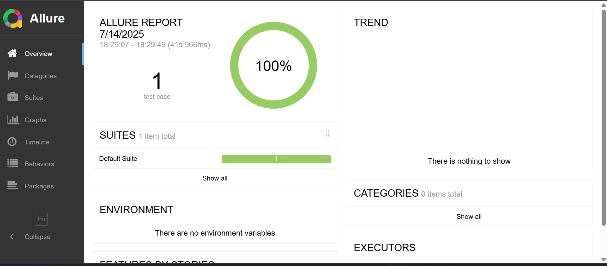
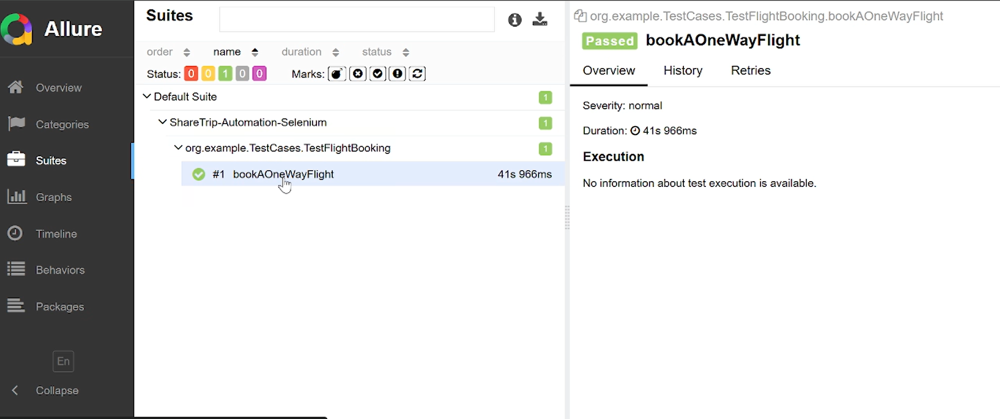

# ShareTrip Selenium Test Automation 

This repository contains an automated UI test suite for **ShareTrip**, built using:

- Java + Selenium WebDriver
- TestNG as a test framework
- Maven for build and dependency management
- Allure for test reporting

---

## 📁 Folder Structure

    
 

    Transmediainc-Automation/  
    ├── pom.xml # Maven configuration and dependencies  
    ├── testngSuite.xml # TestNG suite XML configuration  
    ├── src/  
    │ ├── main/    
    │ └── test/  
    │ │ └── java/
    │ │ │  └── Configuration/
    │ │ │  │  └── DriverSetup.java
    │ │ │  └── pages/
    │ │ │  │  └── FlightBooking.java
    │ │ │  │  └── HomePage.java
    │ │ │  └── testCases/
    │ │ │  │  └── TestFlightBooking.java
    │ │ │  └── Utilities/
    │ │ │  │  └── Variables.java

## ✅ Features

- Page Object Model (POM) design pattern
- TestNG for test configuration and execution
- Browser-based automation using Selenium
- Configuration via  TestNG XML
- Allure HTML reports with test evidence

## 🧪 Test Scenarios

The automation test suite includes:

1.  **Book a fligh for ShareTrip**  

    -   Go to ShareTrip home page and select One Way
    -   Write departure and destination airport name
    -   Select flight date
    -   Select number of travellers
    -   Choose travel class
    -   Then click search button and see all flights
    
   ## ▶️  How to Run the Tests

### ✅ Prerequisites

- Java 17+ installed
- Maven installed
- Allure installed
- ChromeDriver is available in the system path or configured in code

### 🔧 Clone and Build

    git clone git@github.com:nahid2553/ShareTrip-Automation-Selenium.git 
    cd ShareTrip-Automation-Selenium
    
### 🚀 Run locally 

    mvn clean install
    mvn clean test
### 📝 Generate Allure Report 

    allure generate allure-results --clean -o allure-report
### 🔎 Open Allure Report

    allure open allure-report

 # 📊 Sample Report Output
 

The HTML report contains:
-   Execution summary
-   Test case results
-   Response details and assertions
-   Failure trace 
You can open the report in any browser.
# 📌 Notes

-   Make sure project run locally.
    
    
----------

## 👤 Author
S M Nahid Iqbal
